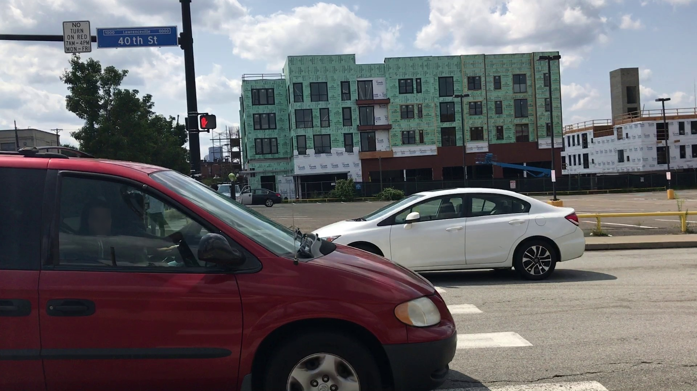

# AutoKeyPointDetectNet

[Портфолио](https://jellywilliam.github.io)

[Ссылка на репозиторий](https://github.com/JellyWilliam/AutoKeyPointDetectNet)

# Набор данных

[CarFusion](https://paperswithcode.com/dataset/vehicle-pose-estimation) представляет собой набор из изображений,
на которых присутствуют автомобили и соответствующий набор ключевых точек каждого автомобиля

Пример данных:

**Фото**



**Разметка**

```json
{
  "image_id": 101100001,
  "category_id": 1,
  "iscrowd": 0,
  "id": 0,
  "area": 235572,
  "bbox": [806, 497, 879, 268],
  "num_keypoints": 12,
  "keypoints": [
    913, 708, 1, 989, 734, 1, 1395, 689, 1, 1474, 715, 2, 877, 642, 1, 894, 665, 1, 1524, 604, 1, 1581, 599, 2, 0, 0, 0,
    1152, 532, 1, 1190, 539, 2, 1340, 519, 1, 1405, 527, 2, 0, 0, 0
  ],
  "segmentation": [
    [1340, 519, 1152, 532, 877, 642, 913, 708, 989, 734, 1474, 715, 1581, 599, 1405, 527]
  ]
}
```

# Архитектура

Была выбрана модель **_keypointrcnn_resnet50_fpn_**

# Подготовка к обучению

Датасет был приведен к COCO формату с помощью скрипта [carfusion2coco.py](carfusion2coco.py), позаимствованный из репозитория 
[dineshreddy91/carfusion_to_coco](https://github.com/dineshreddy91/carfusion_to_coco)

## Обучение

В ноутбуке [Обучение модели.ipynb](Обучение%20модели.ipynb) реализованы все этапы обучения модели.

Для упрощения конфигурации модели в данном ноутбуке имеется ячейка, представленная ниже

```python
# Устройство, на котором будут проводиться вычисления
device = 'cuda' if torch.cuda.is_available() else 'cpu'
print(device)

# Путь до обучающего датасета carfusion
train_carfusion_dataset_path = "D:/ProjectsData/Car Key Point/datasets/carfusion/train"
# Путь до обучающей аннотации carfusion
train_carfusion_annotation_path = "D:/ProjectsData/Car Key Point/datasets/carfusion/annotations/car_keypoints_train.json"

# Путь до тестового датасета carfusion
test_carfusion_dataset_path = "D:/ProjectsData/Car Key Point/datasets/carfusion/test"
# Путь до тестовой аннотации carfusion
test_carfusion_annotation_path = "D:/ProjectsData/Car Key Point/datasets/carfusion/annotations/car_keypoints_test.json"

# Предобработчик для KeypointRCNN ResNet50 FPN
transforms = KeypointRCNN_ResNet50_FPN_Weights.DEFAULT.transforms()
# Количество обучающих эпох
n_epoch = 1

# Путь до сохранения модели
save_path = "D:/ProjectsData/Car Key Point/models/keypointrcnn_resnet50_fpn.pt"
# 
load_checkpoint = False
# 
checkpoint_path = "D:/ProjectsData/Car Key Point/models/keypointrcnn_resnet50_fpn.pt"

# Путь до тестового изображения
test_image_path = "10_0361.jpg"
# Путь до сохранения различных уровней при тестировании (вместо {} будет указан уровень)
save_img_path = "out/out_{}.jpg"
```

## Веса модели

Вы можете загрузить веса **_keypointrcnn_resnet50_fpn_** по данной [ссылке](https://drive.google.com/file/d/1457APbaetA9OuRV3Icm_MsC4majXXgUJ/view?usp=sharing)
